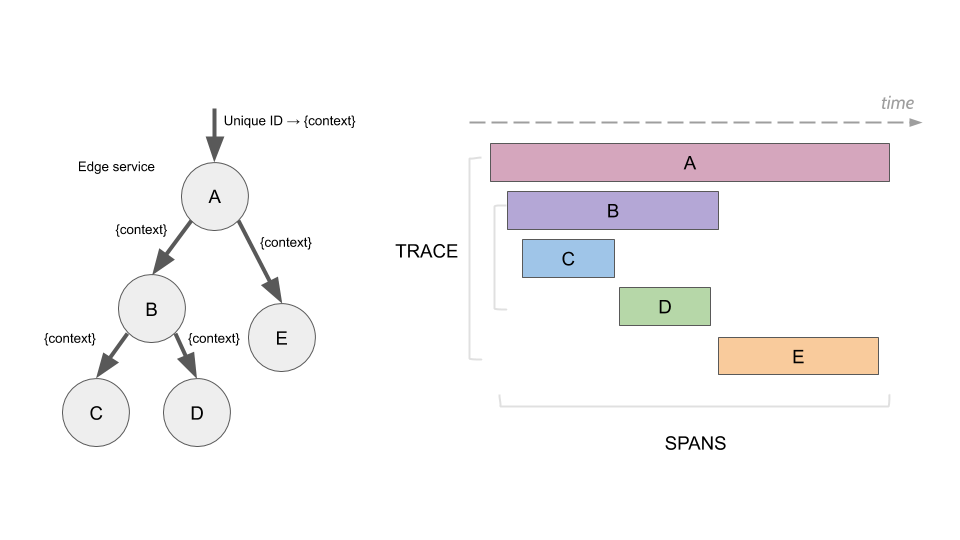
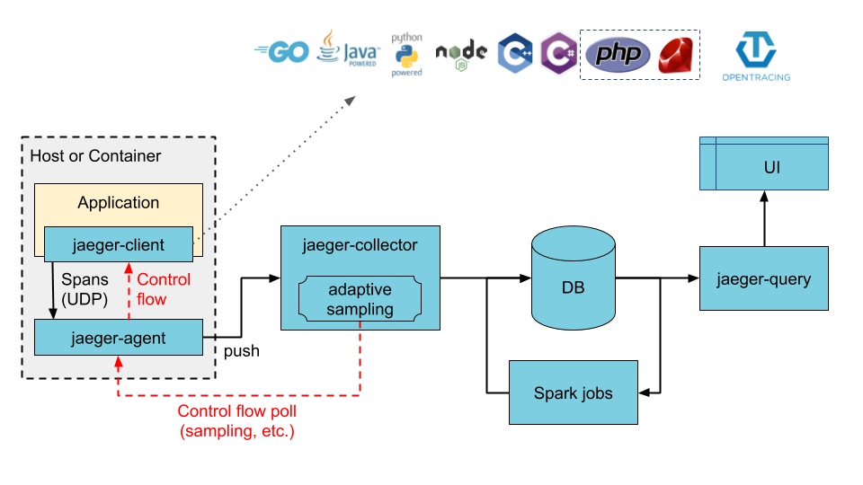
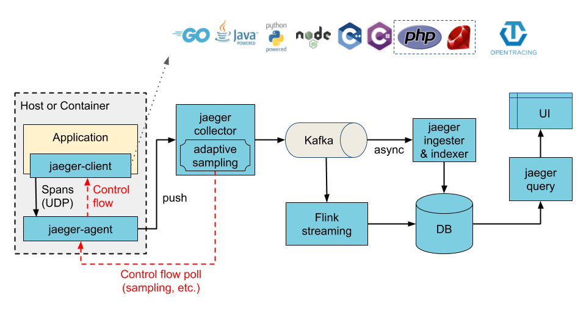
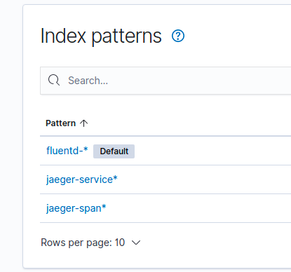
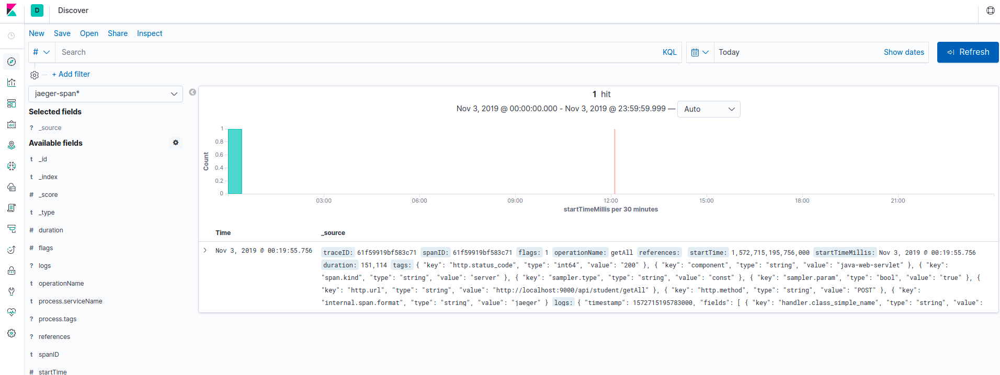
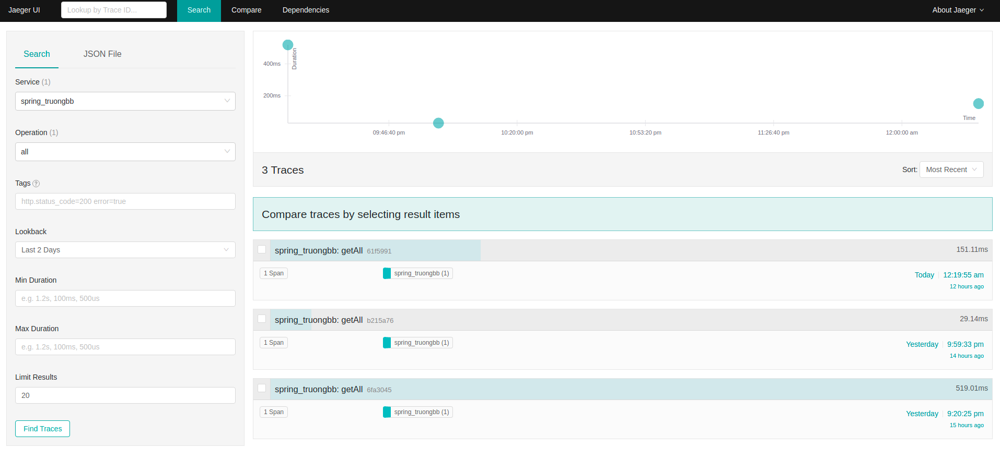
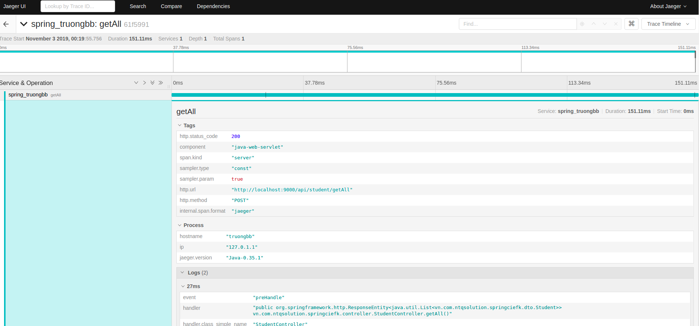

# JAEGER TRACING – AN INTRODUCTION DOCUMENT


##  1. Introduction to Jaeger

### 1.1 Introduction

Jaeger, inspired by Dapper and OpenZipkin, is a distributed tracing system released as open source by Uber Technologies. It’s used for monitoring and troubleshooting microservices-based distributed systems, including:

- Distributed context propagation
- Distributed transaction monitoring
- Root cause analysis
- Service dependency analysis
- Performance / latency optimization

### 1.2 Features

<https://www.jaegertracing.io/docs/1.14/features/>

 - 1.2.1 High scalability
- 1.2.2 Native support for OpenTracing
- 1.2.3 Multiple storage backends
- 1.2.4 Modern web UI
- 1.2.5 Cloud Native Deployment
- 1.2.6 Observability
- 1.2.7 Backwards compability with Zipkin


## 2. Jaeger architecture

<https://www.jaegertracing.io/docs/1.14/sampling/>

### 2.1 Some notions

#### 2.1.1 Span

A span represents a logical unit of work in Jaeger that has an operation name, the start time of the operation, and the duration. Spans may be nested and ordered to model causal relationships.




#### 2.1.2 Trace

A trace is a data/execution path through the system, and can be thought of as a directed acyclic graph of spans.


### 2.2 Architecture

There are 2 deployment options corresponding with 2 different architectures: 

- Collectors are writing directly to storage.
- Collectors are writing to Kafka as a preliminary buffer.

#### 2.2.1  Collectors are writing directly to storage



As we can see, our application can use many different languages including Go, Java, NodeJS, Python, … It communicates with jaeger-client and sends tracing data to jaeger-agent by spans via UDP protocol. In the next step, jaeger-agent push its collected data to jaeger-collector and collector will save these data to database. Database here can be Elasticsearch, Cassandra, … At the last step, jaeger- query will execute queries to take data from database and visualize into an UI webpage at localhost:16686

#### 2.2.2  Collectors are writing to Kafka as a preliminary buffer



Instead of saving directly into database, in this architecture, jaeger-collector uses Kafka as a preliminary buffer before saving tracing data to database.


## 3. Deployment

### 3.1 Deploy Jaeger

There are many deployment methods to implement jaeger, but in this document we use docker to deploy jaeger because of the advantages of docker. Of course, docker and docker compose must be installed before. We will deploy jaeger using the first architecture: saving data to Elasticsearch.

First of all, we define 3 images used in this deployment inside .env file:

```properties
JAEGER_COLLECTOR_IMAGE=jaegertracing/jaeger-collector
JAEGER_AGENT_IMAGE=jaegertracing/jaeger-agent
JAEGER_QUERY_IMAGE=jaegertracing/jaeger-query
```

By default, we use the newest version of each image.

And the second is the last, docker-compose.yml file:

- Define jaeger-collector service:

```yml
jaeger-collector:
    image: ${JAEGER_COLLECTOR_IMAGE}
    ports:
      - "14269:14269"
      - "14268:14268"
      - "14267:14267"
      - "9411:9411"
    networks:
      - jaeger_net
    restart: always
    environment:
      - SPAN_STORAGE_TYPE=elasticsearch
      - ES_SERVER_URLS=http://192.168.0.103:9200
      - LOG_LEVEL=debug
```

- Define jaeger-agent service:

```yml
jaeger-agent:
    image: ${JAEGER_AGENT_IMAGE}
    hostname: jaeger-agent
    ports:
      - "5775:5775/udp"
      - "6831:6831/udp"
      - "6832:6832/udp"
      - "5778:5778"
    networks:
      - jaeger_net
    restart: always
    environment:
      - COLLECTOR_HOST_PORT=jaeger-collector:14267
      - LOG_LEVEL=debug
    depends_on:
      - jaeger-collector
```

- Define jaeger-query service:

```yml
jaeger-query:
    image: ${JAEGER_QUERY_IMAGE}
    environment:
      - SPAN_STORAGE_TYPE=elasticsearch
      - ES_SERVER_URLS=http://192.168.0.103:9200
      - LOG_LEVEL=debug
    ports:
      - "16686:16686"
      - "16687:16687"
    networks:
      - jaeger_net
    restart: always
    depends_on:
      - jaeger-agent
```

- Finally, define networks:

```yml
networks:
  jaeger_net:
    driver: bridge
```


And Elasticsearch is installed before in EFK stack. So we can see tracing log in Kibana with the index jaeger-span-*, jaeger-service-* and Jaeger UI too.



And we can see the result visualized in Kibana







We can use traceId and spanId from Kibana to trace in Jaeger UI


### 3.2 Config Spring project to trace by Jaeger

- Add dependency:

```xml
<!-- https://mvnrepository.com/artifact/io.opentracing.contrib/opentracing-spring-jaeger-web-starter -->
<dependency>
    <groupId>io.opentracing.contrib</groupId>
    <artifactId>opentracing-spring-jaeger-web-starter</artifactId>
    <version>2.0.3</version>
</dependency>
```

Config in application.yml:


```yml
opentracing:
  jaeger:
    service-name: 'spring_truongbb'
    enabled: true
    enable-b3-propagation: true
    log-spans: true
    const-sampler:
      decision: true
    http-sender:
      url: http://localhost:14268/api/traces
```


## 4. Reference

[1] https://www.jaegertracing.io/docs/1.14/

[2] https://github.com/hamza-labs/distributed-tracing

[3] https://stackoverflow.com/questions/51785812/how-to-configure-jaeger-with-elasticsearch/51790666#51790666

[4] https://github.com/TheManawaha/opentracing_demo

[5] https://github.com/p404/jaeger-elasticsearch-compose/blob/master/docker-compose.yml

[6] https://stackoverflow.com/questions/50855480/how-to-enrich-jaeger-opentracing-data-with-the-application-logs-produced-by-slf/50985064#50985064

[7] https://github.com/hamza-labs/distributed-tracing#dockerizing-jaeger

[8] https://github.com/jaegertracing/jaeger-client-java/tree/master/jaeger-core

[9] https://github.com/opentracing-contrib/java-spring-jaeger

